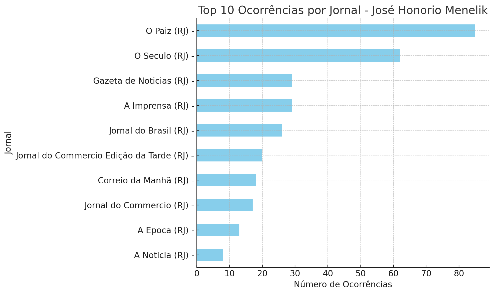
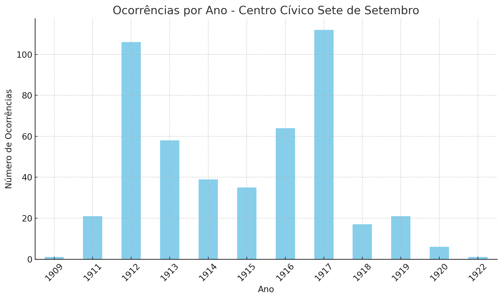
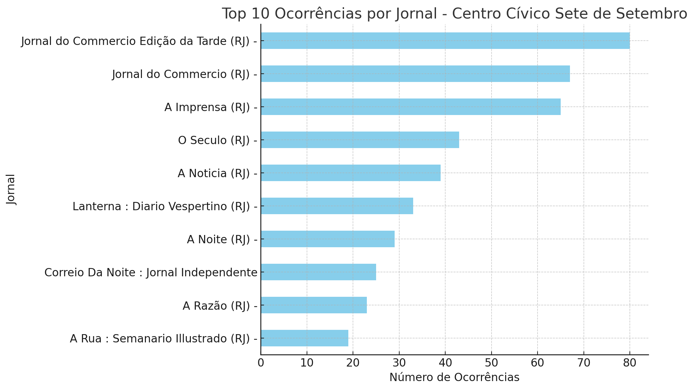

Link para formulário de inscrição: [aqui](https://docs.google.com/forms/d/e/1FAIpQLSf-8WZM44DENpTPzyTgMLI2MZxxnZllmNGGCjM7PeZbaW41oA/viewform)

## Resumo expandido

>3 a 5 mil caracteres com espaço, contendo tema e/ou problema; justificativa e/ou relevância; fontes, referenciais e metodologia; resultados e/ou conclusões

## Eixo prioritário

Opção 1: 5. Trajetórias e práticas de sociabilidade: raça, etnia, classe, gênero e sexualidades

Opção 2: 4. Intelectualidades e ativismos negros e indígenas

---

### Proposta do chat gpt

Tema/Problema: O presente trabalho investiga a atuação de José Honorio Menelik à frente do Centro Cívico Sete de Setembro no Rio de Janeiro entre 1909 e 1919. O estudo se debruça sobre as estratégias de promoção do nacionalismo e da cidadania através da educação dentro da comunidade negra carioca, em um contexto de pós-abolição e de intensa mobilização social.

Justificativa/Relevância: A análise do papel desempenhado por Menelik e pelo Centro Cívico Sete de Setembro é essencial para compreender como as populações negras urbanas, ainda enfrentando os resquícios da escravidão, articularam projetos de emancipação e inclusão social. Menelik, ao tomar emprestado o nome do imperador etíope Menelik II, que resistiu ao colonialismo europeu, simboliza a resistência e a luta pela valorização da identidade afro-brasileira. Este estudo contribui para uma historiografia que busca reconhecer e valorizar as ações protagonizadas por negros na construção da cidadania e da nação brasileira.

Fontes, Referenciais e Metodologia: A pesquisa se baseia em uma variedade de fontes primárias, incluindo jornais da época como O País e Jornal do Brasil, atas de reuniões do Centro Cívico Sete de Setembro, e documentos judiciais. Além disso, o trabalho dialoga com estudos historiográficos sobre a população negra no pós-abolição, associativismo negro e educação popular. A metodologia utilizada inclui a análise documental, cruzamento de dados históricos e leitura crítica das narrativas jornalísticas da época, permitindo reconstruir a trajetória e as práticas sociais do grupo liderado por Menelik.

Dados Apresentados: Utilizando a ferramenta pyHDB (https://ericbrasiln.github.io/pyHDB/), foram realizadas buscas na Hemeroteca Digital Brasileira, resultando em diversas ocorrências dos termos "José Honorio Menelik" e "Centro Cívico Sete de Setembro" em periódicos históricos. As ocorrências de "José Honorio Menelik" totalizam 59 entradas, enquanto as de "Centro Cívico Sete de Setembro" somam 34 entradas. Esses dados serão analisados utilizando métodos de história digital, empregando a biblioteca Pandas para a análise de dados em busca de padrões e relevância. Posteriormente, ferramentas de OCR serão aplicadas para a extração de texto, seguidas pelo uso de técnicas de NLP (Processamento de Linguagem Natural) para a análise de conteúdo.

Resultados/Conclusões: A liderança de José Honorio Menelik no Centro Cívico Sete de Setembro foi marcada por iniciativas de alfabetização, promoção do nacionalismo e fortalecimento dos laços comunitários através de eventos cívicos e festivos. A sociedade de instrução, criada em dezembro de 1910, rapidamente ganhou destaque, atingindo 600 sócios em três meses​
​. Menelik aproveitou momentos como o carnaval para expandir as redes sociais e políticas do grupo, reafirmando o papel dos negros na vida pública e na construção de um projeto nacional inclusivo. A presença do Centro Cívico em desfiles, junto a outras agremiações como a Liga Africana, demonstra a articulação de uma identidade afro-brasileira engajada e combativa​

​.

As conclusões indicam que, apesar das adversidades, Menelik e seus contemporâneos conseguiram criar espaços de resistência e promoção da cidadania através da educação e da mobilização social. O estudo evidencia como a memória e a figura de Menelik II serviram como inspiração e símbolo de luta anti-imperialista e de valorização da ancestralidade africana no Brasil.

### visualização geral dos dados da planilha sobre José Honorio Menelik

Dados Gerais

    Total de ocorrências: 361

Ocorrências por Ano

    As ocorrências variam de 1902 a 1937, com um pico significativo em 1911 (57 ocorrências).

Ocorrências por Jornal - José Honorio Menelik

    O Paiz: 85 ocorrências
    O Seculo: 62 ocorrências
    A Imprensa: 29 ocorrências
    Gazeta de Noticias: 29 ocorrências
    Jornal do Commercio: 25 ocorrências

Visualizações

    Ocorrências por Ano
        A maior concentração de ocorrências se deu nos anos de 1908 a 1912, refletindo uma fase ativa na documentação sobre José Honorio Menelik.

    Ocorrências por Acervo
        As publicações "O Paiz" e "O Seculo" são as fontes mais frequentes para referências a José Honorio Menelik, destacando a importância dessas mídias na cobertura de suas atividades.

### visão geral dos dados da planilha sobre o "Centro Cívico Sete de Setembro":

Dados Gerais

    Total de ocorrências: 481

Ocorrências por Ano

    As ocorrências variam de 1909 a 1922, com um pico significativo em 1917 (112 ocorrências).

Ocorrências por Jornal

    As publicações com o maior número de ocorrências são:
        Jornal do Commercio Edição da Tarde: 80 ocorrências
        Jornal do Commercio: 67 ocorrências
        A Imprensa: 65 ocorrências
        O Seculo: 43 ocorrências
        A Noticia: 39 ocorrências

Visualizações

    Ocorrências por Ano
        A maior concentração de ocorrências se deu nos anos de 1912 e 1917, refletindo uma fase ativa na documentação sobre o Centro Cívico Sete de Setembro.

    Top 10 Ocorrências por Jornal
        As publicações mais frequentes são "Jornal do Commercio Edição da Tarde" e "Jornal do Commercio", destacando a importância desses jornais na cobertura das atividades do Centro Cívico Sete de Setembro.

Esses dados destacam os principais veículos de imprensa que cobriram as atividades do Centro Cívico Sete de Setembro, demonstrando a relevância desses jornais na documentação histórica do período. 

### Análise do Acervo "O Sete de Setembro (RJ) - 1919"

O jornal "O Sete de Setembro", publicado pelo próprio Centro Cívico Sete de Setembro em 1919, possui 8 ocorrências documentadas na Hemeroteca Digital Brasileira. As edições e páginas documentadas fornecem uma visão importante sobre a atividade e comunicação interna do Centro Cívico.

#### Detalhes das Ocorrências:
1. **Edição 01A, Página 1** - [Link](http://memoria.bn.br/docreader/749036/1)
2. **Edição 01A, Página 3** - [Link](http://memoria.bn.br/docreader/749036/3)
3. **Edição 01B, Página 1** - [Link](http://memoria.bn.br/docreader/749036/5)
4. **Edição 01B, Página 3** - [Link](http://memoria.bn.br/docreader/749036/7)
5. **Edição 01C, Página 3** - [Link](http://memoria.bn.br/docreader/749036/11)
6. **Edição 02, Página 1** - [Link](http://memoria.bn.br/docreader/749036/13)
7. **Edição 02, Página 2** - [Link](http://memoria.bn.br/docreader/749036/14)
8. **Edição 02, Página 3** - [Link](http://memoria.bn.br/docreader/749036/15)

Essas edições documentam a própria comunicação do Centro Cívico Sete de Setembro, fornecendo uma fonte direta de suas atividades, objetivos, e impacto na comunidade. A análise desse acervo é fundamental para compreender a visão e estratégia do Centro Cívico em sua própria voz.

### José Honório Menelik: Um Protagonista na Educação e Cidadania Pós-Abolição

José Honório Menelik foi uma figura proeminente no Rio de Janeiro nas primeiras décadas do século XX, destacando-se como advogado, professor e funcionário público. Menelik desempenhou um papel crucial nos debates sobre cidadania e educação no período pós-abolição, ao lado de outras figuras importantes como o deputado negro Manuel da Mota Monteiro Lopes e o padre negro Cônego Olympio de Castro.

#### Formação e Carreira

Menelik formou-se bacharel em direito pela Universidade do Rio de Janeiro em 1908. Posteriormente, ele trabalhou como escriturário do Laboratório Nacional de Análises entre 1916 e 1920, período no qual contribuiu significativamente para a administração pública e a promoção da educação. Além disso, foi diretor do Colégio Brasil Portugal e professor no externado Amorelli, demonstrando seu compromisso contínuo com a educação.

#### Atuação na Educação e Cidadania

Como membro do Centro Cívico Sete de Setembro e do Centro Cívico Monteiro Lopes, Menelik esteve profundamente envolvido na criação e manutenção de escolas noturnas para trabalhadores, uma iniciativa vital para a alfabetização e educação de adultos na comunidade negra. O Centro Cívico Monteiro Lopes foi fundado em homenagem ao falecido deputado Monteiro Lopes, um político estreitamente ligado aos trabalhadores negros da região portuária do Rio.

Menelik também foi membro da Liga Brasileira contra o Analfabetismo, uma organização fundada em 1915 com o objetivo de erradicar o analfabetismo no Brasil. A liga, que encerrou suas atividades em 1940 após as realizações educacionais de Getúlio Vargas, contou com a participação de diversos intelectuais e líderes sociais, entre eles Menelik, que integrava o conselho deliberativo【57†source】.

#### Contribuições Culturais e Políticas

Além de suas atividades educacionais, Menelik foi um ativo participante de eventos culturais e políticos. Ele colaborou com o escritor negro Lima Barreto e participou como julgador de concursos carnavalescos ao lado de figuras como Vagalume. Menelik esteve presente em eventos em comemoração ao 13 de maio, celebrando a abolição da escravidão, e foi membro da Federação dos Homens de Cor, uma organização que, embora efêmera, desempenhou um papel significativo na promoção dos direitos dos negros no Rio de Janeiro.

#### Importância Histórica

O impacto de José Honório Menelik na sociedade brasileira vai além de suas realizações profissionais. Seu envolvimento em múltiplas frentes - como educação, cultura, e política - reflete a luta contínua pela inclusão e valorização da comunidade negra no Brasil pós-abolição. Seu legado, inspirado pelo imperador Menelik II da Etiópia, que resistiu ao colonialismo europeu, é um testemunho da resistência e da busca por justiça social e igualdade.

Em resumo, José Honório Menelik representa uma figura central nos esforços para promover a cidadania e a educação no Brasil do início do século XX. Seu trabalho, tanto em organizações educacionais quanto em eventos culturais, solidifica seu lugar como um defensor incansável dos direitos e do progresso da população negra brasileira.

---

## Versão final

**Título:** José Honorio Menelik e o Centro Cívico Sete de Setembro: cidadania e educação no Rio de Janeiro (cc. 1910-1930)

O presente trabalho investiga a atuação de José Honorio Menelik à frente do Centro Cívico Sete de Setembro no Rio de Janeiro nas décadas de 1910 e 1920. José Honório Menelik foi uma figura proeminente no Rio de Janeiro nas primeiras décadas do século XX, destacando-se como advogado, professor e funcionário público. Menelik desempenhou um papel crucial nos debates sobre cidadania e educação no período pós-abolição, ao lado de outras figuras importantes como o deputado negro Monteiro Lopes e o padre negro Cônego Olympio de Castro. Formado bacharel em direito pela Universidade do Rio de Janeiro em 1908, ele trabalhou como escriturário do Laboratório Nacional de Análises entre 1916 e 1920. Como membro do Centro Cívico Sete de Setembro e do Centro Cívico Monteiro Lopes, Menelik esteve profundamente envolvido na criação e manutenção de escolas noturnas para trabalhadores, uma iniciativa vital para a alfabetização e educação de adultos na comunidade negra.

A análise do papel desempenhado por Menelik e pelo Centro Cívico Sete de Setembro é relevante para compreender como as populações negras urbanas, ainda enfrentando os resquícios da escravidão, articularam projetos de emancipação e inclusão social. Menelik também foi membro da Liga Brasileira contra o Analfabetismo, uma organização fundada em 1915 com o objetivo de erradicar o analfabetismo no Brasil. Além de suas atividades educacionais, Menelik foi um ativo participante de eventos culturais e políticos, colaborando com o escritor Lima Barreto e participando como julgador de concursos carnavalescos ao lado de figuras como Vagalume. Seu envolvimento em múltiplas frentes - como educação, cultura e política - reflete a luta contínua pela inclusão e valorização da comunidade negra no Brasil pós-abolição. Seu legado, inspirado pelo imperador Menelik II da Etiópia, que resistiu ao colonialismo europeu, é um testemunho da resistência e da busca por justiça social e igualdade.

A pesquisa se baseia em uma variedade de fontes primárias, incluindo jornais da época como O País e Jornal do Brasil, documentos judiciais, civis, fotografias e cartas. Além disso, o trabalho dialoga com a historiografia sobre o pós-abolição, associativismo negro e educação popular. A metodologia utilizada inclui a análise documental, cruzamento de dados históricos e leitura crítica das narrativas jornalísticas da época, permitindo reconstruir a trajetória e as práticas sociais do grupo liderado por Menelik. Utilizando a ferramenta pyHDB (https://ericbrasiln.github.io/pyHDB/), foram realizadas buscas na Hemeroteca Digital Brasileira, da Biblioteca Nacional, resultando em centenas de ocorrências dos termos "honorio menelik" e "centro civico sete de setembro" em periódicos históricos. As ocorrências de  "honorio menelik" totalizam 361 entradas, enquanto as de "centro civico sete de setembro" somam 481 entradas. Esses dados, devidamente organizados e documetnados, serão analisados utilizando métodos de história digital, empregando a biblioteca Pandas para do dataset em busca de padrões e relevância. Posteriormente, ferramentas de OCR serão aplicadas para a extração de texto, seguidas pelo uso de técnicas de NLP (Processamento de Linguagem Natural) para a análise de conteúdo. Especificamente, foram identificadas ocorrências importantes do jornal "O Sete de Setembro", publicado pelo próprio Centro Cívico Sete de Setembro em 1919, fornecendo uma fonte direta de suas atividades, objetivos e impacto na comunidade.

A liderança de José Honorio Menelik no Centro Cívico Sete de Setembro foi marcada por iniciativas de alfabetização, promoção do nacionalismo e fortalecimento de redes de sociabilidade através de eventos cívicos e festivos. A sociedade de instrução, criada em dezembro de 1910, rapidamente ganhou destaque, atingindo 600 sócios em três meses. Menelik aproveitou momentos como o carnaval para expandir as redes sociais e políticas do grupo, reafirmando o papel dos negros na vida pública e na construção de um projeto nacional inclusivo. A presença do Centro Cívico em desfiles, junto a outras agremiações como a Liga Africana, demonstra a articulação de uma identidade afro-brasileira engajada e combativa. As conclusões indicam que, apesar das limitações impostas pelo regime republicanos, Menelik e seus contemporâneos buscaram criar espaços de resistência e promoção da cidadania através da educação e da mobilização social.

